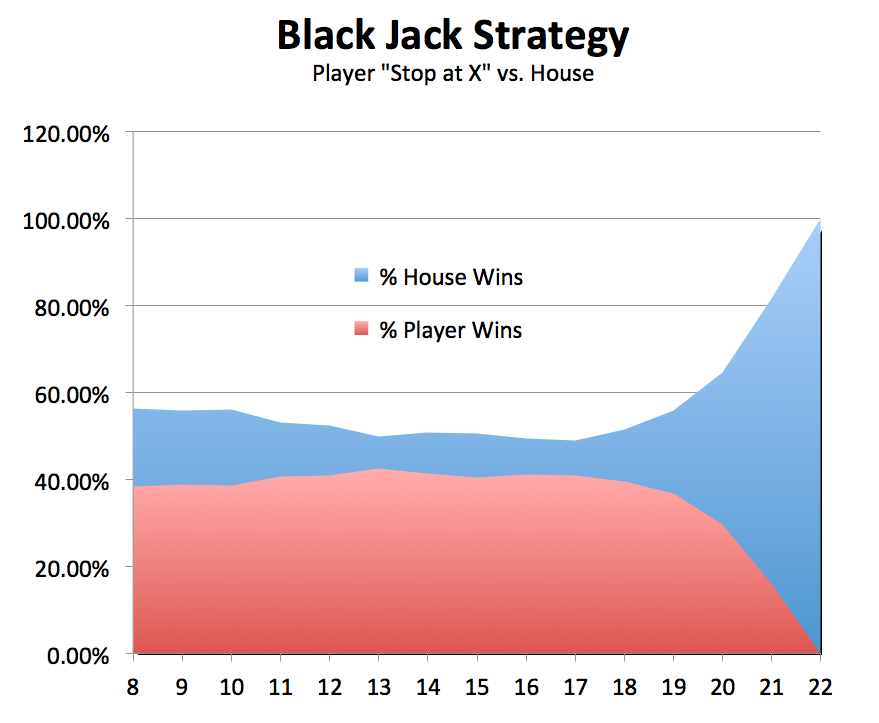

BlackJack
=========

This is a BlackJack Game and simulator written in
ruby as I was showing my kids what programming was like.

The folder is "ready to use" as a Netbeans project.

The program can run in interactive mode and
also in simulation mode of one player with a
programmable strategy playing against the house.

My machine can simulate about 4000 games per second
in simulation mode.

You can see some sample output from simulation:

available in these files as well

	sample-output.csv
and
	sample-output.xls
	(same data, with a nice graph)

Carlos
